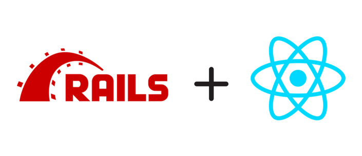

<p align="center">
  
</p>

## Description
This project is CRUD **notes** and **categories** application powered by Ruby on Rails and React.

Demo: [notes](https://notes.logdata.me).

## Major opportunities and advantages:
* Every user has his own notes and categories;
* Delete all selected notes or categories with one click;
* Set categories' color;
* Custom pretty design with adaptive for Mobile;
* Convenient work with notes and categories;
* All CRUD operations with notes and categories execute without re-rendering or any Ajax.
It's just React;
* Pretty backend documentation;
* Frontend interact with backend safely using token;
* Frontend and backend have tests guaranteeing code without bugs.

<h3 align="center"><b>Categories</b></h3>
<p align="center">
  
</p>

<h3 align="center"><b>Notes</b></h3>
<p align="center">
  
</p>

## Backend
* API only **Ruby on Rails** functionality;
* PostgreSQL;
* **apitome** and **rspec_api_documentation** gems are for documentation available on
**/api/docs** by default;
* All backend code written in conformity with Rubocop;
* **devise** and **devise-jwt** gems are for security of application. Unique token
generates with algorithm **HS256** and expires after one day;
* **react-rails** gem allow integrate React into Rails.
## Frontend
* **React**, **Redux**;
* **Jest** and **Enzyme** are for testing frontend application.

## How to start
* Clone repository `$ git clone git@github.com:Davhot/notes.git`;
* Set ENV variables (for example, you can use [rbenv-vars](https://github.com/rbenv/rbenv-vars)):
1. `DEVISE_JWT_SECRET_KEY` - you can set it just with `rake secret`;
2. Database params. You can copy `config/database.yml.default` to `config/database.yml` and set your
settings.

```ruby
$ bundle install
$ rails db:migrate
$ yarn install
$ rails s
```

Note. Regenerate documentation: `$ rake docs:generate`.

## Run tests
* You can run only backend tests: `$ bundle exec rspec`
* Frontend tests: `$ yarn run test`
* Or both: `$ make test`

## Deploy
Using Puma, Capistrano, Docker, docker-composer, Nginx.
More info [here](https://base.logdata.me/articles/18).
